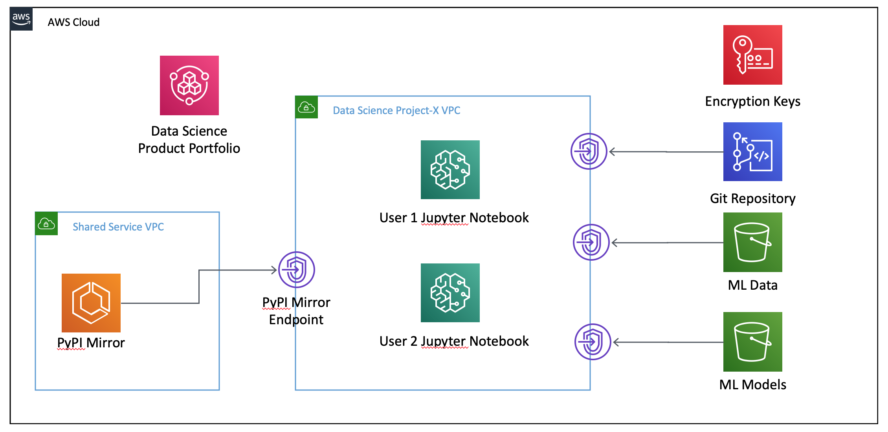

# Secure Data Science Reference Architecture

## Overview

Amazon SageMaker is a powerful enabler and a key component of a data science environment, but it’s only part of what is required to build a complete and secure data science environment. For more robust security you will need other AWS services such as Amazon CloudWatch, Amazon S3, and AWS VPC. This project aims to be an example of how to pull together these services, to use them together to create secure, self-service, data science environments.

## Table of Contents

  1. [Getting Started](#getting-started)
  1. [Features](#features)

      * [Private Network per Data Science Environment](#private-network-per-data-science-environment)
      * [Authentication and Authorization](#authentication-and-authorization)
      * [Data Protection](#data-protection)
      * [Auditability](#auditability)

  1. [Architecture and Process Overview](#architecture-and-process-overview)
  1. [Repository Breakdown](#repository-breakdown)
  1. [Further Reading](#further-reading)
  1. [License](#license)

## Getting Started

Use the following links below to quickly deploy this repository to your AWS account.  No need to clone or fork the repository - the source code is available in Amazon S3 ready for deployment via CloudFormation.  To get started click one of the buttons below.

| Region | Launch Template |
|:---:|:---|
| Oregon (us-west-2) | [](https://console.aws.amazon.com/cloudformation/home?region=us-west-2#/stacks/create/review?stackName=secure-ds-core&templateURL=https://s3.amazonaws.com/sagemaker-workshop-cloudformation-us-west-2/quickstart/ds_administration.yaml) |
| Ohio (us-east-2) | [](https://console.aws.amazon.com/cloudformation/home?region=us-east-2#/stacks/create/review?stackName=secure-ds-core&templateURL=https://s3.amazonaws.com/sagemaker-workshop-cloudformation-us-east-2/quickstart/ds_administration.yaml) |
| N. Virginia (us-east-1) | [](https://console.aws.amazon.com/cloudformation/home?region=us-east-1#/stacks/create/review?stackName=secure-ds-core&templateURL=https://s3.amazonaws.com/sagemaker-workshop-cloudformation-us-east-1/quickstart/ds_administration.yaml) |
| Ireland (eu-west-1) | [](https://console.aws.amazon.com/cloudformation/home?region=eu-west-1#/stacks/create/review?stackName=secure-ds-core&templateURL=https://s3.amazonaws.com/sagemaker-workshop-cloudformation-eu-west-1/quickstart/ds_administration.yaml) |
| London (eu-west-2) | [](https://console.aws.amazon.com/cloudformation/home?region=eu-west-2#/stacks/create/review?stackName=secure-ds-core&templateURL=https://s3.amazonaws.com/sagemaker-workshop-cloudformation-eu-west-2/quickstart/ds_administration.yaml) |
| Sydney (ap-southeast-2) | [](https://console.aws.amazon.com/cloudformation/home?region=ap-southeast-2#/stacks/create/review?stackName=secure-ds-core&templateURL=https://s3.amazonaws.com/sagemaker-workshop-cloudformation-ap-southeast-2/quickstart/ds_administration.yaml) |

#### Step 1, as yourself

Assuming you are signed into the AWS console, clicking one of the buttons above will take you to the AWS CloudFormation console for your selected region.  Accept the stack's default values, tick the boxes for `Capabilities` and click `Create stack`.  After approximately 5 minutes the stack will have deployed a Shared Services VPC to be leveraged across all data science environments and a PyPI mirror for pre-approved Python package hosting within your network.  The stack also will have deployed a product portfolio for creating data science enviornments.  

#### Step 2, as a project administrator

To access the portfolio click the `Outputs` tab of the CloudFormation stack and use the `AssumeProjectAdminRole` link to become a project administrator, capable of creating data science project environments.  Once you've assumed the role you can visit the [AWS Service Catalog console](https://console.aws.amazon.com/servicecatalog/home?isSceuc=true#/products) to deploy a data science environment.

Click the context menu icon next to the `Data Science Project Environment` product and click `Launch product`.  After you provide a name for the product launch, and provide a project name, click `Launch` and you will have created your first data science project environment.  This will launch a CloudFormation stack to provision the data science environment.  This will require about 10 minutes to execute.

#### Step 3, as a project team member

When the data science project environment has completed its deployment you will have 2 links available from the Service Catalog console to assume user roles in the data science environment.  Click on the `AssumeProjectUserRole` and return to the [AWS Service Catalog console](https://console.aws.amazon.com/servicecatalog/home?isSceuc=true#/products) to launch a Jupyter notebook.

Click the context menu icon next to the `SageMaker Notebook` product, select `Launch product`, and give your notebook product a name.  Provide an email address, specify the name of the project this notebook belongs to, and a username.  Click `Launch` and 5 minutes later you will be provided with a hyperlink to open your Jupyter notebook server.  

#### Step 4, Explore

From the Jupyter notebook server, using the sample notebooks, you can develop features, train, host, and monitor a machine learning model in a secure manner.  If you assume your original AWS role you can also, from the AWS console, explore the various features deployed by the CloudFormation stacks.


## Features

This source code demonstrates a self-service model for enabling project teams to create data science environments that employ a number of recommended security practices.  Some of the more notable features are listed below.  The controls, mechanisms, and services deployed by this source code is intended to provide operations and security teams with the assurance that their best practice is being employed while also enabling project teams to self service, move quickly, and stay focused on the data science task at hand.

### Private Network per Data Science Environment

For every data science environment created a Virtual Private Cloud (VPC) is deployed to host Amazon SageMaker and other components of the data science environment.  The VPC provides a familiar set of network-level controls to allow you to govern ingress and egress of data.  These templates create a VPC with no Internet Gateway (IGW), therefore all subnets are private, without Internet connectivity.  Network connectivity with AWS services or your own shared services is provided using [VPC endpoints](https://docs.aws.amazon.com/vpc/latest/userguide/vpc-endpoints.html) and [PrivateLink](https://aws.amazon.com/privatelink/).  Security Groups are used to control traffic between different resources, allowing you to group like resources together and manage their ingress and egress traffic.

### Authentication and Authorization

AWS Identity and Access Management (IAM) is used to create least-privilege, preventive controls for many aspects of the data science enviroments.  These preventive controls, in the form of IAM policies, are used to control access to a project's data in Amazon S3, control who can access SageMaker resources like Notebook servers, and are also applied as VPC endpoint policies to put explicit controls around the API endpoints created in a data science environment.

There are several IAM roles deployed by this source code to manage permissions and ensure separation of concerns at scale.  Those roles are:

- **Project Administrator role**

    Granting permissions to create data science environments via the AWS Service Catalog.

- **Data science environment administrator role**

    Granting permissions to administer project-specific resources.

- **Data science environment user role**

    Granting Console access, start/stop Jupyter notebook, open Jupyter notebook, create Jupyter notebook via Service Catalog

- **Notebook execution role**

    Used by a Jupyter Notebook to access AWS resources, this is created on a per user per notebook basis.  This role can be re-used for training jobs, batch transformations, and other Amazon SageMaker resources to support auditbility.

The IAM policies created by this source code use many [IAM conditions](https://docs.aws.amazon.com/IAM/latest/UserGuide/reference_policies_actions-resources-contextkeys.html) to grant powerful permissions but only under certain conditions.  

### Data Protection

It is assumed that a data science environment contains highly sensitive data to train ML models, and that there is also sensitive intellectual property in the form of algorithms, libraries, and trained models.  There are many ways to protect data such as the preventive controls described above, defined as IAM policies.  In addition this source code encrypts data at rest using managed encryption keys.

Many AWS services, including Amazon S3 and Amazon SageMaker, are integrated with AWS Key Management Service (KMS) to make it very easy to encrypt your data at rest.  This source code takes advantage of these integrations to ensure that your data is encrypted in Amazon S3 and on Amazon SageMaker resources, end to end.  This encryption is also applied to your intellectual property as it is being developed in the many places it may be stored such as Amazon S3, EC2 EBS volumes, or AWS CodeCommit git repository.

### Auditability

Using cloud services in a safe and responsible manner is good, but being able to demonstrate to others that you are operating in a governed manner is even better.  Developers and security officers alike will need to see activity logs for models being trained and persons interacting with the systems.  Amazon CloudWatch Logs and CloudTrail are there to help, receiving logs from many different parts of your data science environment to include:

 - Amazon S3
 - Amazon SageMaker Notebooks
 - Amazon SageMaker Training Jobs
 - Amazon SageMaker Hosted Models
 - VPC Flow Logs

## Architecture and Process Overview



Once deployed, this CloudFormation stack provides you with a Data Science Product Portfolio, powered by [AWS Service Catalog](https://aws.amazon.com/servicecatalog/).  This allows users who have assumed the *Project Administrator* role to deploy new data science environments using the *Data Science Environment* product within the catalog.  Project Administrators can specify a project name, the environment type, and a few other criteria to launch the data science environment.  AWS Service Catalog will then create a data science project environment consisting of:

  - A private, isolated, dedicated network environment built using an [Amazon VPC](https://aws.amazon.com/vpc/)
  - [Private connectivity](https://aws.amazon.com/privatelink/) to specific AWS services and a customer-hosted, shared-service deployment of a PyPI mirror
  - Private, dedicated [Amazon S3 buckets](https://aws.amazon.com/s3/) for project data and intellectual property
  - A project Git repository hosted by [AWS CodeCommit](https://aws.amazon.com/codecommit/)
  - Project-specific encryption keys managed by [AWS Key Management Service (KMS)](https://aws.amazon.com/kms/)
  - Dedicated [AWS Identity & Access Management (IAM)](https://aws.amazon.com/iam/) roles for project resources
  - A project-specific product portfolio so project team members can provision resources for themselves

To use the environment, project team members can assume the *Data Science Project Administrator* role or the *Data Science Project User* role.  Once they have assumed a project role users can provision resources within the data science environment.  By visiting the AWS Service Catalog console they can access the project's product portfolio and launch an Amazon SageMaker notebook.  

AWS Service Catalog will then deploy an Amazon SageMaker-powered Jupyter notebook server using an approved CloudFormation template.  This will produce a Jupyter notebook server with:

  - A KMS-encrypted EBS volume attached
  - An IAM role associated with the notebook server which represents the intersection of user, notebook server, and project
  - An attachment to the data science project VPC
  - User access to `root` permissions disabled
  - Notebook server access to network resources outside of the project VPC disabled
  - A convenience Python module generated with constants defined for AWS KMS key IDs, VPC Subnet IDs, and Security Group IDs

Once the notebook server has been deployed the user can access the notebook server directly from the Service Catalog console.

## Repository Breakdown

This repository contains the following files:

```bash
├── CODE_OF_CONDUCT.md                      # Guidance for participating in this open source project
├── CONTRIBUTING.md                         # Guidelines for contributing to this project
├── LICENSE                                 # Details for the MIT-0 license
├── README.md                               # This readme
├── cloudformation
│   ├── publish_cloudformation.sh           # Bash shell script to package and prepare CloudFormation for deployment
│   ├── ds_admin_detective.yaml             # Deploys a detective control to manage SageMaker resources
│   ├── ds_admin_principals.yaml            # Deploys the Project Administrator role
│   ├── ds_administration.yaml              # Deploys nested stacks
│   ├── ds_env_backing_store.yaml           # Deploys a project's S3 buckets and CodeCommit repository
│   ├── ds_env_catalog.yaml                 # Deploys a project's product portfolio
│   ├── ds_env_network.yaml                 # Deploys a project's private network
│   ├── ds_env_principals.yaml              # Creates a project administrator and user
│   ├── ds_env_sagemaker.yaml               # Creates a lifecycle configuration for this project
│   ├── ds_environment.yaml                 # Manages nested stacks for a project
│   ├── ds_notebook_v1.yaml                 # Early version of a Jupyter notebook product
│   ├── ds_notebook_v2.yaml                 # Refined version of a notebook product
│   ├── ds_shared_services_ecs.yaml         # PyPI mirror running on AWS Fargate
│   └── ds_shared_services_network.yaml     # Creates a shared services VPC
├── docs
│   └── images
│       └── hla.png
└── src
    ├── detective_control
    │   └── inspect_sagemaker_resource.py   # Lambda function to detect non-VPC-attached SageMaker resources
    └── project_template
        ├── 00_SageMaker-SysOps-Workflow.ipynb          # Sample Jupyter notebbok to demonstrate security controls
        ├── 01_SageMaker-DataScientist-Workflow.ipynb   # Sample Jupyter notebook to demonstrate secure ML lifecycle
        ├── 02_SageMaker-DevOps-Workflow.ipynb          # Second half of a secure ML lifecycle
        ├── credit_card_default_data.xls                # Sample data set
        ├── util
            ├── __init__.py
            └── utilsspec.py
```

## Further Reading

There is a multitude of material and resources available to you to advise you on how to best support your business using AWS services.  The following is a non-exhaustive list in no particular order:

 - [Amazon SageMaker documentation regarding security](https://docs.aws.amazon.com/sagemaker/latest/dg/security.html)
 - [Sample Lifecylce Configuration scripts for Amazon SageMaker](https://github.com/aws-samples/amazon-sagemaker-notebook-instance-lifecycle-config-samples)
 - [AWS Well-Architected Framework: Machine Learning Lens](https://d1.awsstatic.com/whitepapers/architecture/wellarchitected-Machine-Learning-Lens.pdf)
 - [Secure and Compliant Machine Learning Workflows with Amazon SageMaker (video)](https://youtu.be/HlSEUvApDZE)
 - [An Overview of Amazon SageMaker Security (video)](https://youtu.be/zTJTzKcNzMk)
 - [Building Secure Machine Learning Environments using Amazon SageMaker (video)](https://youtu.be/txr6CR87GXI)

## License

This source code is licensed under the [MIT-0 License](https://github.com/aws/mit-0). See the [LICENSE](LICENSE) file for details.
